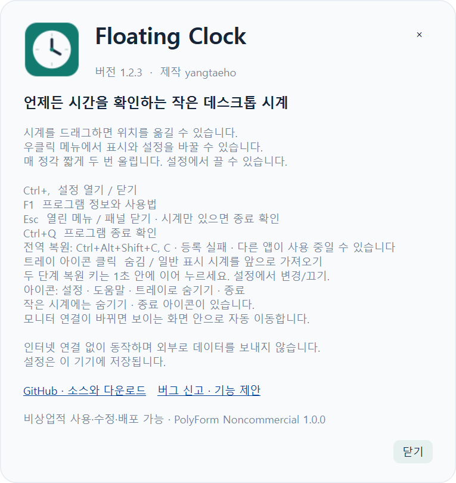
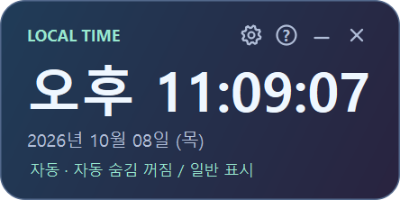
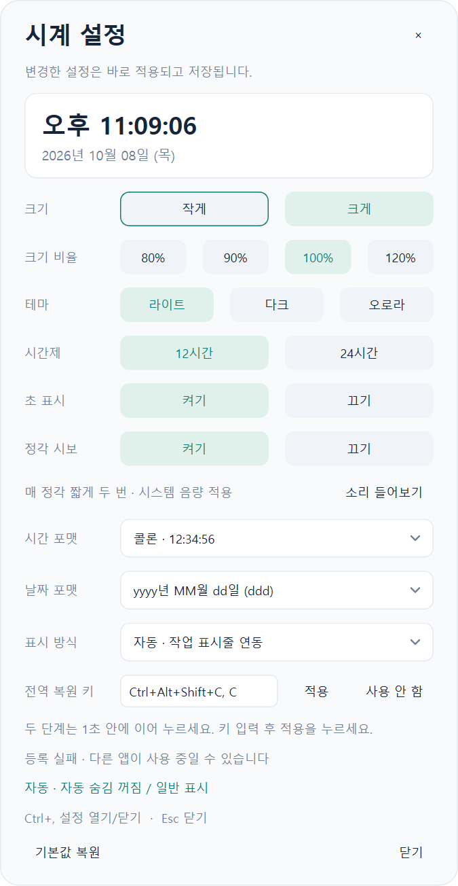

# Floating Clock

작업 표시줄이 자동 숨김 상태여도 시분초·연월일을 확인할 수 있는 오프라인 데스크톱 시계입니다.


## 실행과 조작

Windows에서는 `dist/FloatingClock.exe`를 더블클릭합니다. Python 설치가 필요 없습니다.

- 기본값: **작은 크기 / 라이트 테마 / 12시간제 / 초 표시 켜짐**. 크기 비율은 Mac 90%, Windows 100%.
- 시간 기본 예시: `오후 10:34:56`. 날짜 기본 예시: `2026년 10월 07일 (수)`.
- 창 크기는 시간·날짜 포맷과 글꼴/DPI에 맞춰 계산합니다. 짧은 포맷은 폭을 줄이고 초가 바뀌어도 폭은 유지합니다. 작은 시계 오른쪽에는 트레이로 숨기기와 종료 아이콘이 있습니다.
- **F1**: 프로그램 정보와 사용법. 버전 **1.2.3**과 작성자 표시. 우클릭 메뉴에서도 열 수 있습니다.
- Windows는 기본적으로 시스템 트레이에 상주하고 작업표시줄 버튼을 만들지 않습니다. Mac 앱은 메뉴 막대에 아이콘을 표시하는 유틸리티로 Dock을 차지하지 않습니다. 트레이가 없는 환경에서는 일반 창으로 표시합니다.
- 트레이 아이콘을 클릭하거나 메뉴의 **시계 앞으로 가져오기**를 선택하면 숨김/일반 표시 상태의 시계를 복원해 앞으로 가져옵니다. **Windows는 `Ctrl+Alt+Shift+C`, Mac은 `⌘⌥⇧C`를 누른 뒤 1초 안에 `C`**를 누르면 다른 앱을 사용 중에도 복원합니다. 설정에서 1~2단계 조합으로 변경하거나 끌 수 있습니다. 다른 앱이 이 키를 선점한 경우 도움말에 사용 불가를 표시하며 트레이로 복원할 수 있습니다. 트레이에는 주 화면으로 위치 초기화, 설정, 도움말, 종료도 있습니다. 숨겨도 시보는 계속 동작하며 재실행하면 기존 시계 하나를 다시 표시합니다.
- 드래그로 이동. 종료 아이콘 또는 `Ctrl+Q`로 종료 확인창을 엽니다. 기본 선택은 취소이며, 종료를 확인하면 시보와 트레이도 종료합니다.
- **`Ctrl+,`**: 설정창 열기/닫기. 보조 단축키 `Ctrl+Shift+S`. Mac에서는 `Cmd+,`도 지원합니다. 앱 포커스가 필요합니다.
- `Esc`: 메뉴나 설정창이 열려 있으면 해당 창만 닫기. 시계만 있을 때는 종료 확인.
- 우클릭 메뉴: 설정, 크기·테마·12/24·초 빠른 변경, 위치 초기화, 종료. ↑/↓와 Enter로 선택하고 밖 클릭/Esc로 닫습니다.
- 큰 시계 우상단은 **설정 → 도움말 → 트레이로 숨기기 → 종료** 아이콘 순서입니다. 각 버튼에는 인위적 대기 없이 아이콘 위에 표시되는 테마 툴팁과 접근성 이름이 있습니다. 트레이가 없는 환경은 숨기기 버튼을 사용할 수 없습니다.



## 설정

오로라 테마는 남색·보라색 그라데이션과 민트 포인트를 사용합니다. 설정에서 선택하면 시계와 패널에 함께 적용됩니다.



변경 즉시 시계에 적용되고 저장됩니다. 설정창에서 실제 현재 시각의 미리보기를 확인할 수 있습니다.

| 설정 | 선택 | 기본값 |
|---|---|---|
| 크기 | 작게 / 크게 | 작게 |
| 크기 비율 | 80% / 90% / 100% / 120% | Mac 90%, Windows 100% |
| 테마 | 라이트 / 다크 / 오로라 | 라이트 |
| 시간제 | 12시간 / 24시간 | 12시간 |
| 초 표시 | 켜기 / 끄기 | 켜기 |
| 정각 시보 | 켜기 / 끄기, 소리 들어보기 | 켜기 |
| 시간 포맷 | 콜론 / 한글 단위 / 점 구분 | 콜론 |
| 날짜 포맷 | 한글 날짜+짧은 요일 / 한글 전체 요일 / 한글 짧은 날짜 / ISO+요일 / 슬래시 | yyyy년 MM월 dd일 (ddd) |
| 표시 방식 | 자동 / 항상 위 / 일반 | 자동 |

시간 프리셋의 12시간 표시는 오전/오후로 구분합니다. 자정과 정오는 12시입니다. 초 끄기는 모든 시간 프리셋에 적용됩니다.

매 정각 같은 길이의 명료한 높은 소리가 두 번 울립니다. v1.1.0에서 각 음을 120ms로 늘리고 끝음 페이드와 무음 꼬리를 추가했습니다. 기존 음량은 유지합니다. 설정의 `정각 시보`에서 끄거나 `소리 들어보기`로 확인할 수 있습니다. 시스템 음량·음소거가 적용됩니다. 초 표시를 꺼도 시보는 동작하며, 시계 프로그램이 실행 중일 때만 울립니다. 실행 직후·절전 복귀·시간 변경에는 지난 시보를 뒤늦게 재생하지 않습니다.



설정은 Windows `%LOCALAPPDATA%/FloatingClock/settings.json`에 저장합니다. 이전 버전의 기본 날짜 `korean_full`은 새 날짜 형식으로 이전하고, 다른 프리셋·위치·표시 방식은 보존합니다. R005부터 기존 `korean_spaced_short` 선택도 단위 앞 공백 없는 형식으로 표시합니다. v3 이후 명시적으로 선택한 긴 요일 형식도 보존합니다. `기본값 복원`은 시보를 포함한 옵션을 초기화하며 위치는 유지합니다.

R003부터 Qt 투명 창에 앤티앨리어싱으로 경계를 그려, 작은/큰·라이트/다크 모두 모서리를 부드럽게 표시합니다. 설정창은 테마를 따르는 헤더이며 빈 헤더 영역을 드래그하여 이동할 수 있습니다. 설정 변경은 창이나 컨트롤을 재생성하지 않으며, Windows topmost 변경은 활성 창을 바꾸지 않습니다.

## 작업 표시줄 감지

Windows 자동 모드는 작업 표시줄의 **자동 숨기기 설정**을 1초마다 조회합니다. 켜짐이면 항상 위, 꺼짐이면 일반 표시로 돌아갑니다. 작업 표시줄이 잠시 펼쳐져도 자동 숨기기 설정이 켜져 있으면 항상 위를 유지합니다. Explorer 재시작 중에는 마지막 상태를 유지하고 다시 조회합니다.

보안 데스크톱(UAC), 잠금 화면, 일부 독점 전체 화면 게임은 일반 창과 다른 표시 규칙을 사용합니다. 연결된 모든 모니터의 작업 영역 안에 있는 위치는 보존합니다. 모니터 연결/해제, 배율·작업 영역 변경으로 창이 밖으로 나가면 가장 많이 겹치거나 가까운 화면 안으로 시계와 열린 패널을 이동합니다. 음수 좌표의 모니터도 지원합니다. 실제 UHD 케이블 분리와 다양한 장치의 배율 전환은 별도 사용자 확인이 필요합니다.

## 소스 실행·검증·빌드

Python 3.12 이상과 PySide6가 필요합니다. 런타임·빌드 의존성은 프로젝트 `.venv`에 설치합니다.

```powershell
cd floating-clock
./build-windows.ps1
./.venv/Scripts/python.exe main.py
./.venv/Scripts/python.exe -m unittest -v
./.venv/Scripts/python.exe smoke_ui.py --capture
./.venv/Scripts/python.exe smoke_audio.py
```

- 로직 테스트: 자정/정오, 윤년, 12/24·초·포맷, 기본값·이전 설정·손상 복구, Shell 비트, 비Windows 경로 및 정각·중복·절전·시간 변경·두 음 WAV.
- UI 스모크: 실제 Qt 창에서 1440개 표시 조합의 잘림·경계 부분 투명도, 설정 변경 후 활성 창/포커스, 열린 드롭다운과 1초 타이머, 실제 목록 키보드 선택, 네이티브 topmost, 메뉴·단축키·종료를 검사합니다. 사용자 설정을 변경하지 않습니다.
- `smoke_settings.py`: 작은/큰 화면 × 세 테마에서 시각·설정 변경·열린 드롭다운·스크롤 위치의 안정성을 검사하며 Mac offscreen CI에서도 수행합니다.
- `--capture`: Qt에서 자체 창만 PNG로 캡처해 `previews/`를 갱신합니다.
- `smoke_audio.py`: 소리를 한 번 재생하여 Qt 오디오 준비·재생·종료와 포커스 유지, 정각 타이머의 한 번 재생을 검사합니다. 사용자 설정은 변경하지 않습니다.
- `dist/FloatingClock.exe --verify-build`: 빌드된 실제 EXE의 시각·설정·표시 정보를 `build/packaged-verification.json`, 창 이미지를 `build/packaged-preview.png`에 기록하고 종료합니다.
- Windows 빌드는 프로젝트 `.venv`에 빌드 도구를 설치하고 `dist/FloatingClock.exe`를 만듭니다.
- `build_app.py`는 PATH에 있는 다른 프로그램의 ICU DLL이 포함되지 않도록 합니다. Qt가 요구하는 Windows 시스템 ICU를 사용합니다. 일반 PyInstaller 명령 대신 제공한 빌드 스크립트를 사용합니다.

## 구조와 Mac 포팅

- `clock_core.py`: 플랫폼 및 UI 의존성 없는 설정 모델·포맷·시간 갱신·항상 위 정책.
- `chime_core.py`: 플랫폼 독립 정각 판정과 두 음 WAV 생성. `chime_audio.py`는 Qt 비동기 오디오 재생, `assets/hourly-chime.wav`는 직접 합성한 시보 소리입니다.
- `platform_adapter.py`: Windows Shell 감지와 포커스를 바꾸지 않는 네이티브 topmost 변경.
- `hotkey_core.py`: 플랫폼 독립 단축키 검증. `instance_adapter.py`: 사용자별 잠금과 로컬 재실행 복원.
- `bundle_policy.py`: 독립 실행 필수 모듈 보존과 미사용 구성 제외.
- `main.py`: 시계, 드래그, 타이머, 옵션 적용.
- `settings_panel.py`, `ui_components.py`: 공통 설정창, 테마, 팝업 메뉴.
- `settings.py`: OS별 사용자 설정 경로와 저장.

Mac에서는 `sh build-macos.sh`가 PySide6와 빌드 도구를 로컬 `.venv`에 설치하고 `dist/FloatingClock.app`을 만듭니다. 자동 작업 표시줄 감지는 Windows 전용이며 Mac에서는 일반 표시나 수동 항상 위를 사용합니다. 공통 Qt UI를 사용하지만 Mac 실기기에서 모서리·메뉴·단축키는 확인하지 않았습니다. Mac 빌드는 Mac에서 수행하며 서명·공증은 별도입니다.

## 요청 기록

설계와 항목별 진행 상태는 [누적 기록](docs/REQUEST_LEDGER.md), 이후 작업 절차는 [AGENTS.md](AGENTS.md)가 기준입니다.

참고: [Microsoft ABM_GETSTATE](https://learn.microsoft.com/en-us/windows/win32/shell/abm-getstate), [Qt 투명 창](https://doc.qt.io/qtforpython-6/PySide6/QtWidgets/QWidget.html), [PyInstaller 빌드](https://pyinstaller.org/en/stable/usage.html).
시보 재생 API: [Qt QSoundEffect](https://doc.qt.io/qtforpython-6.10/PySide6/QtMultimedia/QSoundEffect.html).

## 독립 저장소와 배포

이 저장소는 [학습 저장소](https://github.com/yangtaeho/study-vibe-coding-production-principles)의 `desktop-clock` 부분을 분리한 시계 전용 저장소입니다. 기존 floating-clock-standalone의 최신 기능과 배포판을 이 이름으로 통합했습니다. 학습 HTML과 이전 혼합 이력은 원본에 보존했습니다. 출처와 파일 해시는 `docs/EXTRACTION.json`에 있습니다.

배포판은 [버전 1.2.3 다운로드](https://github.com/yangtaeho/floating-clock/releases/tag/v1.2.3)에서 내려받습니다. Windows x64 ZIP은 압축을 풀고 FloatingClock.exe를 실행합니다. macOS DMG는 열어서 FloatingClock.app을 Applications로 복사합니다. Apple Silicon(arm64)과 Intel(x64) 버전을 구분합니다. Python이나 Qt를 별도 설치할 필요가 없습니다. macOS 빌드 기준은 macOS 15이며 이전 OS는 미검증입니다.

Mac 앱은 개발자 인증서 서명·Apple 공증이 없는 배포판입니다. macOS가 실행을 차단하면 시스템 설정의 개인정보 보호 및 보안에서 해당 앱의 실행을 허용해야 할 수 있습니다. ARM Mac v1.2.1 실행 성공과 v1.2.2 설정 깜빡임 해소는 사용자 확인을 받았습니다. v1.2.3의 실제 전역 키와 크기 조절은 새 실기기 확인이 필요합니다.

자동 빌드는 `.github/workflows/build.yml`에서 수행합니다. Mac CI의 offscreen 검증은 번들 실행·렌더링·자산 확인이며 실제 화면 포커스나 오디오 장치 검증을 대신하지 않습니다.

아이콘은 `generate_icons.py`로 직접 그린 원본 도안입니다. PNG, Windows ICO, Mac ICNS가 동일한 시계 모양을 사용합니다. 제품 버전은 `app_metadata.py`에서 관리하며 Windows 파일 속성과 macOS 앱 번들에 포함됩니다.


## 공개 이용과 기여

이 저장소는 공개이며 [Issues](https://github.com/yangtaeho/floating-clock/issues)와 [Pull Requests](https://github.com/yangtaeho/floating-clock/pulls)를 받습니다. [기여 안내](CONTRIBUTING.md)를 읽어 주세요.

직접 작성한 소스·아이콘·시보는 [PolyForm Noncommercial 1.0.0](LICENSE)으로 제공합니다. **비상업적 사용·수정·재배포는 자유롭게 할 수 있습니다.** 라이선스와 저작권 공지를 유지해야 하며, 상업적 이용은 저작권자의 별도 허락이 필요합니다. 외부 라이브러리는 각각의 조건을 따릅니다([외부 구성 요소 안내](THIRD_PARTY_NOTICES.md)).

v1.1.0은 모니터 분리 시 위치 복구, 전역 복원 키, 포맷별 크기, 아이콘·숨기기, 메뉴 닫힘, 종료 확인, GitHub 도움말 링크와 완결된 두 음 시보를 개선했습니다. v1.2.3은 Mac 전역 복원 키와 크기 비율을 추가하며, Mac 시계만 기본 90%로 축소합니다. 기존 비율을 명시 선택했다면 유지합니다.

v1.2.2는 설정 변경의 전체 스타일 재적용과 드롭다운 표시 후 재배치를 줄이고, 미리보기 글자 폭과 Mac 스크롤바 자동 숨김에 따른 흔들림을 개선했습니다. ARM Mac의 v1.2.1 실행 성공은 사용자 확인이며 v1.2.2 설정 깜빡임 해소도 사용자 확인을 받았습니다.

v1.2.1은 오로라 테마, 사용자 지정 전역 키, 단일 실행, 즉시 툴팁, 다크 셀렉트와 Windows 제품명을 개선하고 미사용 영상·3D 모듈을 제외해 배포 크기를 줄였습니다.
